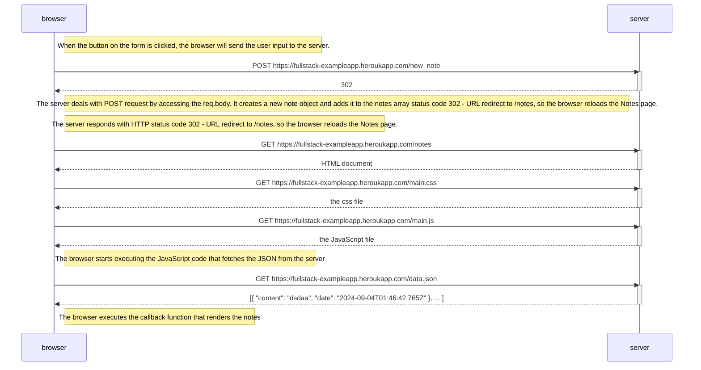

```mermaid
sequenceDiagram
    participant browser
    participant server

    Note right of browser: When the button on the form is clicked, the browser will send the user input to the server.
    browser->>server: POST https://fullstack-exampleapp.heroukapp.com/new_note
    activate server
    server-->>browser: 302
    deactivate server

    Note left of server: The server deals with POST request by accessing the req.body. It creates a new note object and adds it to the notes array status code 302 - URL redirect to /notes, so the browser reloads the Notes page.

    Note right of browser: The server responds with HTTP status code 302 - URL redirect to /notes, so the browser reloads the Notes page.
    
    browser->>server: GET https://fullstack-exampleapp.heroukapp.com/notes
    activate server
    server-->>browser: HTML document
    deactivate server

    browser->>server: GET https://fullstack-exampleapp.heroukapp.com/main.css
    activate server
    server-->>browser: the css file
    deactivate server

    browser->>server: GET https://fullstack-exampleapp.heroukapp.com/main.js
    activate server
    server-->>browser: the JavaScript file
    deactivate server

    Note right of browser: The browser starts executing the JavaScript code that fetches the JSON from the server

    browser->>server: GET https://fullstack-exampleapp.heroukapp.com/data.json
    activate server
    server-->>browser: [{ "content": "dsdaa", "date": "2024-09-04T01:46:42.765Z" }, ... ]
    deactivate server

    Note right of browser: The browser executes the callback function that renders the notes


```