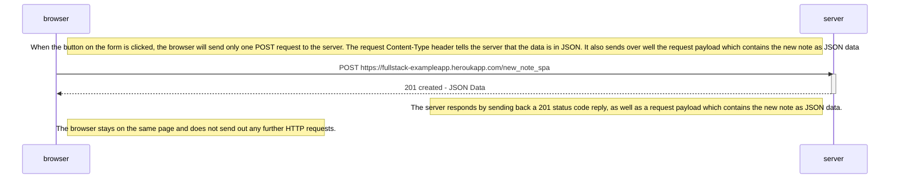

```mermaid
sequenceDiagram
    participant browser
    participant server

    Note right of browser: When the button on the form is clicked, the browser will send only one POST request to the server. The request Content-Type header tells the server that the data is in JSON. It also sends over well the request payload which contains the new note as JSON data
    browser->>server: POST https://fullstack-exampleapp.heroukapp.com/new_note_spa
    activate server
    server-->>browser: 201 created - JSON Data
    deactivate server

    Note left of server: The server responds by sending back a 201 status code reply, as well as a request payload which contains the new note as JSON data.

    Note right of browser: The browser stays on the same page and does not send out any further HTTP requests.


```